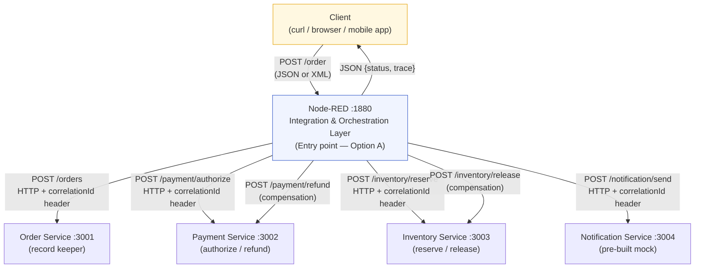
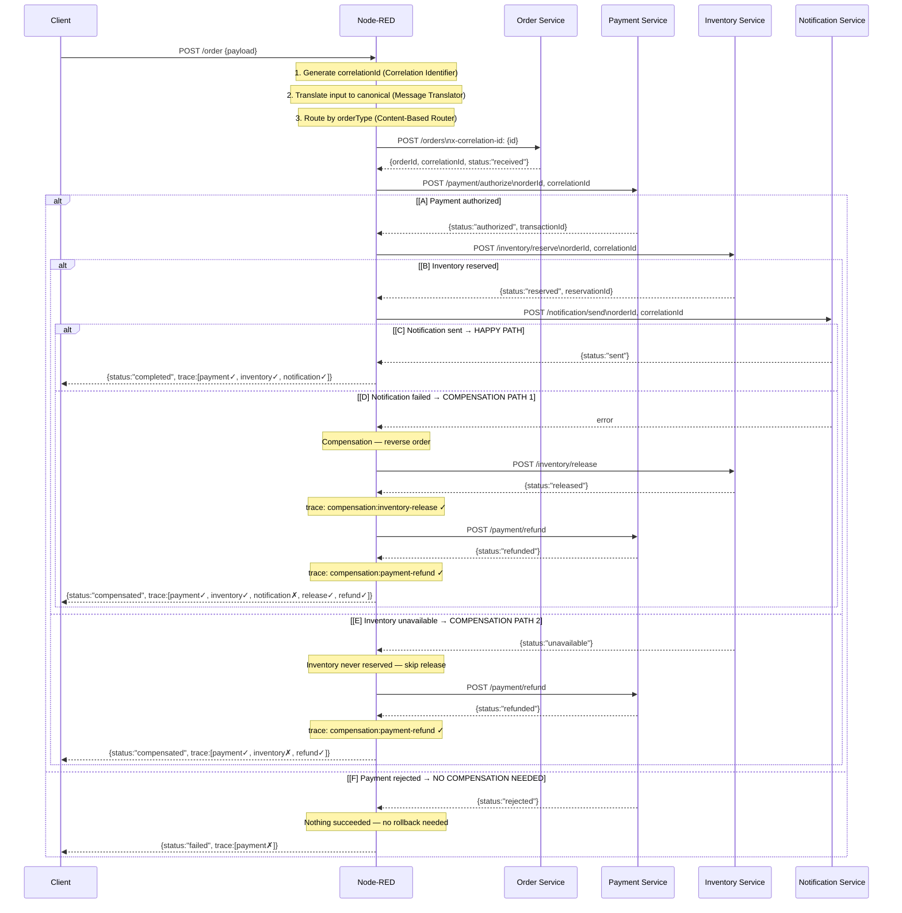

# EAI Capstone — Orchestrated Enterprise Application Integration System

## How to Run

```bash
git clone <your-repo-url>
cd practice-04-capstone
cp .env.example .env
docker compose up -d --build
# Wait ~25 seconds for services to initialise
```

**Verify all services are up:**
```bash
curl http://localhost:1880/health     # Node-RED
curl http://localhost:3001/health     # Order Service
curl http://localhost:3002/health     # Payment Service
curl http://localhost:3003/health     # Inventory Service
curl http://localhost:3004/health     # Notification Service
```

**Send test orders:**
```bash
# Standard web order
curl -s -X POST http://localhost:1880/order \
  -H "Content-Type: application/json" \
  -d @test-data/web-order.json | jq .

# Express mobile order
curl -s -X POST http://localhost:1880/order \
  -H "Content-Type: application/json" \
  -d @test-data/mobile-order.json | jq .

# B2B XML order
curl -s -X POST http://localhost:1880/order \
  -H "Content-Type: text/xml" \
  -d @test-data/b2b-order.xml | jq .
```

**Check notification was triggered:**
```bash
curl http://localhost:3004/admin/logs
```

**Reset between tests:**
```bash
curl -X POST http://localhost:3002/admin/reset
curl -X POST http://localhost:3003/admin/reset
curl -X POST http://localhost:3004/admin/reset
```

**Lookup saga trace:**
```bash
curl http://localhost:1880/trace/<orderId>
```

**Inspect Dead Letter Queue:**
```bash
curl http://localhost:1880/admin/dlq
```

**Stop:**
```bash
docker compose down        # stop
docker compose down -v     # stop + wipe volumes
```

---

## Architecture Decision

**Option A was chosen: Node-RED is the entry point.**

The client sends all orders directly to Node-RED's `POST /order` endpoint. Node-RED acts as the integration bus: it normalises the incoming message (web JSON, mobile JSON, or B2B XML) into canonical form, calls the Order Service to create a persistent record, then sequentially orchestrates Payment → Inventory → Notification. The Order Service is a pure domain record-keeper with no knowledge of the orchestration topology or other services. This design was preferred over Option B because it keeps the business services free of integration concerns — they expose simple HTTP APIs and have no outbound dependencies. In Option B, the Order Service would need to know about Node-RED's internal URL and trigger the orchestration flow directly, coupling a business service to the integration layer. Option A maintains a clean boundary: business services are downstream consumers, never initiators.

---

## Architecture Diagrams

### 1. System Context Diagram



### 2. Integration Architecture Diagram

```mermaid
flowchart LR
    subgraph Entry["Entry & Translation"]
        A["POST /order\nHTTP-in"]
        B["Init Saga\n+ Correlation ID\nEIP: Correlation Identifier"]
        C["Detect\nInput Format"]
        D{{"switch\nCBR: Format\nEIP: Content-Based Router"}}
        E["Translator\nXML→Canonical\nEIP: Message Translator"]
        F["Translator\nMobile→Canonical\nEIP: Message Translator"]
        G["Translator\nWeb (enrich)\nEIP: Message Translator"]
        H{{"switch\nCBR: Order Type"}}
    end

    subgraph Happy["Happy Path"]
        I["POST /orders\nOrder Service"]
        J["POST /payment/authorize\nPayment Service\nEIP: Idempotent Receiver"]
        K["POST /inventory/reserve\nInventory Service\nEIP: Idempotent Receiver"]
        L["POST /notification/send\nNotification Service"]
        M(["status: completed\n+ trace"])
    end

    subgraph Fail["Failure Paths"]
        N(["status: failed"])
    end

    subgraph Comp["Compensation (Saga — reverse order)"]
        P["POST /inventory/release"]
        Q["POST /payment/refund"]
        R(["status: compensated\n+ trace"])
        S(["DLQ\nEIP: Dead Letter Channel"])
    end

    A --> B --> C --> D
    D -->|xml| E --> H
    D -->|mobile| F --> H
    D -->|else| G --> H
    H --> I --> J

    J -->|authorized| K
    J -->|rejected| N

    K -->|reserved| L --> M
    K -->|unavailable| Q

    L -->|failed| P --> Q

    Q -->|refunded| R
    Q -->|failed| S

    style S fill:#ffe0e0,stroke:#cc3333
    style M fill:#e0ffe0,stroke:#33aa33
    style R fill:#fff3cd,stroke:#cc9900
    style N fill:#ffeaea,stroke:#cc3333
```



### 3. Orchestration Flow — Success + Both Compensation Paths



---

## EIP Pattern Mapping Table

| Pattern | Problem It Solves | Where Applied | Why Chosen |
|---|---|---|---|
| **Content-Based Router** | Three input formats (web JSON, mobile JSON, B2B XML) and three order types (standard, express, b2b) need to be routed to different handlers. A single processor cannot handle all variants correctly. | Two `switch` nodes in the Orchestration tab: `orch-format-switch` routes by `_inputFormat` (xml / mobile / else), `orch-route-by-type` routes by `payload.orderType`. Each output leads to a dedicated translator or priority-setter node. Neither uses a monolithic function node. | The business domain explicitly has multiple input channels and order classes. Using Node-RED `switch` nodes makes the routing decision visible in the flow canvas and independently testable. A single giant function node would hide the routing logic and violate the Pipes & Filters structural principle. |
| **Correlation Identifier** | Five independent services produce their own log entries. Without a shared identifier, it is impossible to reconstruct the full lifecycle of a single order from distributed logs or to debug a failure. | A `correlationId` (UUID v4) is generated once in the `orch-init-context` node at the start of every saga. It is propagated in the `x-correlation-id` HTTP header AND in the JSON body of every downstream call (to Order, Payment, Inventory, Notification services). Each service logs and echoes the ID. The Admin tab's `GET /trace/:orderId` uses it to retrieve the full saga record. | Ensures end-to-end traceability across all five services with a single lookup key. Explicitly required by the spec. Generating a fresh ID per service (a common mistake) would make correlation impossible. |
| **Dead Letter Channel** | If compensation itself fails — e.g. the payment refund endpoint is unavailable — the saga is permanently stuck in an inconsistent state. Without a DLQ, the failure is silently swallowed and there is no way to trigger manual recovery. | The `eh-dlq` function node in the Error Handling tab. When `eh-after-refund` detects a failed refund response, its second output routes to `eh-dlq` instead of the HTTP response node. The DLQ entry (with full trace and reason) is stored in Node-RED `global` context and returned to the client as HTTP 500. Entries are inspectable via `GET /admin/dlq`. | Unrecoverable failures must be captured rather than dropped. `global` context was chosen over `flow` context deliberately — DLQ entries must be readable from the Admin tab which runs in a different flow scope. |
| **Message Translator** | The three input channels use incompatible field names and data structures: web orders use canonical JSON, mobile orders use abbreviated single-letter keys with numeric currency codes and Unix timestamps, B2B orders use XML with `<PurchaseOrder>` / `<LineItem>` elements. Downstream nodes must always receive consistent canonical data. | Three dedicated translator function nodes: `orch-translate-xml` (parses XML attributes and elements into canonical JSON), `orch-translate-mobile` (maps `oid→orderId`, `cur→currency` with ISO lookup, `ts→orderDate` conversion), `orch-translate-web` (enriches missing fields). All three converge on `orch-route-by-type` which only ever sees canonical payloads. | Translation is isolated per format, making each converter independently maintainable and testable. Downstream nodes are completely decoupled from input format variance. |
| **Idempotent Receiver** | A client may retry a timed-out HTTP call, or the orchestrator may replay a message, causing double-charges or double inventory reservations — both catastrophic. | Both `payment-service` and `inventory-service` check their in-memory `callLog` for an existing successful result with the same `correlationId` before executing. If found, they return the cached `transactionId` / `reservationId` without re-running the operation and set `idempotent: true` in the response. | Prevents duplicate side-effects in an at-least-once HTTP environment. The correlationId (not orderId) is used as the idempotency key because one order might legitimately generate multiple retries of the same operation. |

---

## Failure Analysis

### Scenario 1 — Payment Rejection (`PAYMENT_FAIL_MODE=always`)

**Setup:**
```bash
# In docker-compose.yml under payment-service:
#   PAYMENT_FAIL_MODE: always
docker compose up -d payment-service
```

**Test:**
```bash
curl -s -X POST http://localhost:1880/order \
  -H "Content-Type: application/json" \
  -d @test-data/web-order.json | jq .
```

**Expected response:**
```json
{
  "orderId": "ord-xxxxxxxx",
  "correlationId": "...",
  "status": "failed",
  "trace": [
    { "step": "payment", "status": "failed", "reason": "Payment declined", "durationMs": 12 }
  ]
}
```

**System reaction:** The payment service returns HTTP 422 `{ status: "rejected" }`. The `orch-check-payment` switch routes to `orch-payment-failed`, which appends a failed trace entry, then to `orch-build-failed`. The inventory and notification services are **never called** — verify with `curl http://localhost:3003/admin/logs` (returns `[]`). No compensation is triggered because nothing succeeded; there is nothing to roll back.

**Final state:** Order record in Order Service with `status: "received"` (never updated). Payment service call log has one `authorize` entry with `result: "rejected"`. Inventory and notification logs are empty. Saga stored in global context with `status: failed`.

---

### Scenario 2 — Inventory Unavailable (`INVENTORY_FAIL_MODE=always`)

**Setup:**
```bash
# In docker-compose.yml under inventory-service:
#   INVENTORY_FAIL_MODE: always
docker compose up -d inventory-service
```

**Test:**
```bash
curl -s -X POST http://localhost:1880/order \
  -H "Content-Type: application/json" \
  -d @test-data/web-order.json | jq .
```

**Expected response:**
```json
{
  "orderId": "ord-xxxxxxxx",
  "correlationId": "...",
  "status": "compensated",
  "trace": [
    { "step": "payment", "status": "success", "durationMs": 15 },
    { "step": "inventory", "status": "failed", "reason": "Insufficient stock", "durationMs": 8 },
    { "step": "compensation:payment-refund", "status": "success", "durationMs": 10 }
  ]
}
```

**System reaction:** Payment authorises successfully (transactionId stored in saga context). Inventory returns HTTP 422 `{ status: "unavailable" }`. The `orch-check-inventory` switch routes to `orch-inventory-failed`, which records the failure and wires directly to `eh-refund-payment` in the Error Handling tab — inventory release is skipped because the reservation never succeeded. The refund call succeeds and the response is `status: "compensated"`. The notification service is **never called**.

**Compensation order verification:** `curl http://localhost:3002/admin/logs` shows an `authorize` entry followed by a `refund` entry, both sharing the same `correlationId`. Inventory log shows one `reserve` call with `result: "unavailable"` and no `release` call (correct — nothing to release).

**Final state:** Payment refunded. No stock reserved. No notification sent. Saga stored in global context as `compensated` and inspectable via `GET /trace/:orderId`.

---

### Restore After Testing

```bash
# Restore to normal (edit docker-compose.yml: set FAIL_MODE values back to 'never')
docker compose up -d payment-service inventory-service
```
